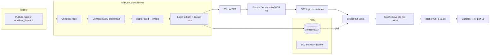

# Portfolio – Amal Viswanath

TypeScript + React portfolio, built with Vite. Run locally with the dev server or Docker; production is built into a container and deployed to **Amazon EC2** via **GitHub Actions**, **ECR**, and **Docker**.

## Live site

**[http://ec2-13-60-168-120.eu-north-1.compute.amazonaws.com/](http://ec2-13-60-168-120.eu-north-1.compute.amazonaws.com/)**

*(Public DNS for an EC2 instance can change if the instance is replaced; update this link if your host changes.)*

## Run locally (development)

```bash
npm install
npm run dev
```

Open [http://localhost:5173](http://localhost:5173).

## Run production build locally

```bash
npm run build
npm run preview
```

Or with Docker (build + nginx):

```bash
docker build -t portfolio .
docker run -p 8080:80 portfolio
```

Open [http://localhost:8080](http://localhost:8080).

## Deployment lifecycle (ECR + EC2)

Pushes to `main` (or a manual workflow run) trigger `.github/workflows/deploy.yml`. The pipeline builds the same Docker image you use locally, stores it in ECR, then replaces the running container on your Ubuntu EC2 instance.



**Step-by-step:**

1. **Trigger** – Workflow runs on `push` to `main` or **Actions → Run workflow**.
2. **Build on GitHub** – Runner checks out the repo, assumes AWS credentials, logs in to ECR, builds the image from the `Dockerfile`, and pushes `:latest` to your ECR repository.
3. **Deploy over SSH** – Runner connects to EC2 using `EC2_HOST` / `EC2_USER` / `EC2_KEY`.
4. **Instance bootstrap (each run)** – Ensures Docker, curl, unzip, and AWS CLI v2 are present; Docker service is enabled.
5. **Pull and swap** – Instance authenticates to ECR (using the same IAM credentials passed into that SSH session), pulls the new image, stops and removes the container named `my-portfolio`, then starts a fresh container mapping **host port 80 → container port 80** (nginx inside the image serves the built site).
6. **Live** – Traffic to the instance’s public DNS on port 80 serves the new build (e.g. the [live URL](http://ec2-13-60-168-120.eu-north-1.compute.amazonaws.com/) above).

### GitHub configuration

In **Settings → Secrets and variables → Actions**:

**Secrets**

| Secret | Description |
|--------|-------------|
| `AWS_ACCESS_KEY_ID` | IAM access key (ECR push/pull + used on EC2 for `get-login-password`) |
| `AWS_SECRET_ACCESS_KEY` | IAM secret key |
| `ECR_REPOSITORY` | Full ECR image URI (e.g. `123456789012.dkr.ecr.eu-north-1.amazonaws.com/your-repo`) |
| `EC2_HOST` | Public hostname or IP of the instance |
| `EC2_USER` | SSH user (e.g. `ubuntu`) |
| `EC2_KEY` | Private SSH key PEM (full key material, including headers) |

**Variables (optional)**

| Variable | Description |
|----------|-------------|
| `AWS_REGION` | Region for ECR and CLI (default in workflow: `eu-north-1`) |

The workflow uses GitHub **environment** `prod` when you configure it in the repo.

### IAM (high level)

The IAM user tied to the secrets needs permissions to authenticate and push to ECR from Actions, and permission for the same credentials to call `ecr:GetAuthorizationToken` / pull images from the instance (the workflow exports keys on the EC2 session for `docker login`). Tighten this over time with instance IAM roles and `aws ecr get-login-password` without long-lived keys on the box.

### EC2 checklist

- **Ubuntu** (workflow uses `apt`, not `yum`).
- Security group allows **inbound TCP 80** (and **22** for SSH from the runner or your IP).
- Optional: bake Docker + AWS CLI into the AMI to skip install steps on every deploy.

---

## Optional: S3 static hosting reference

If you also use S3 for static assets or an alternate hosting path, see `docs/s3-bucket-policy-example.json` for example bucket policies. The current CI workflow does **not** sync `dist/` to S3.

## Project structure

- `src/` – React app (components, data, styles)
- `src/data/portfolio.ts` – Portfolio content (edit to update your info)
- `public/` – Static assets
- `Dockerfile` – Multi-stage build: Node build, nginx serve
- `.github/workflows/deploy.yml` – Build, push to ECR, deploy to EC2

## Scripts

| Command | Description |
|---------|-------------|
| `npm run dev` | Start Vite dev server |
| `npm run build` | TypeScript + Vite build |
| `npm run preview` | Serve `dist/` locally |
| `npm run lint` | Run ESLint |
